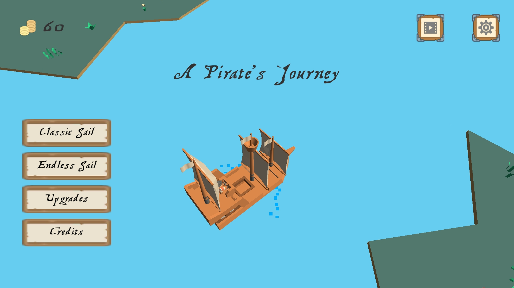
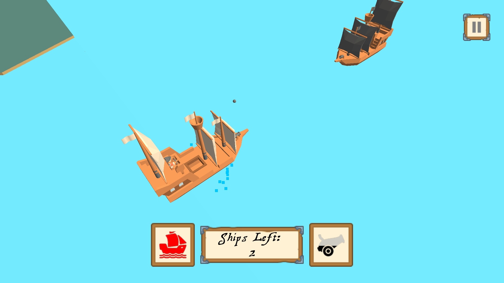
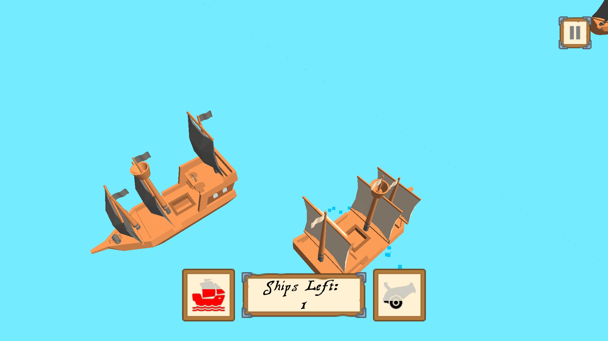
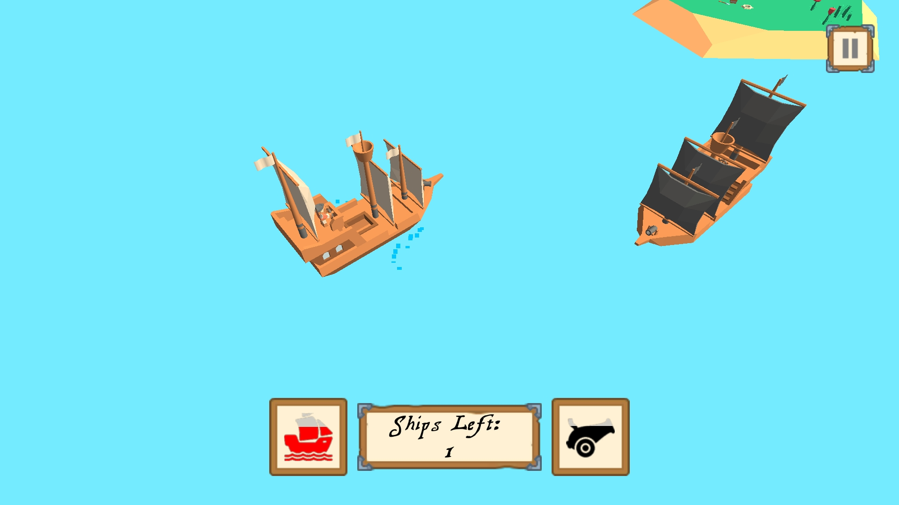
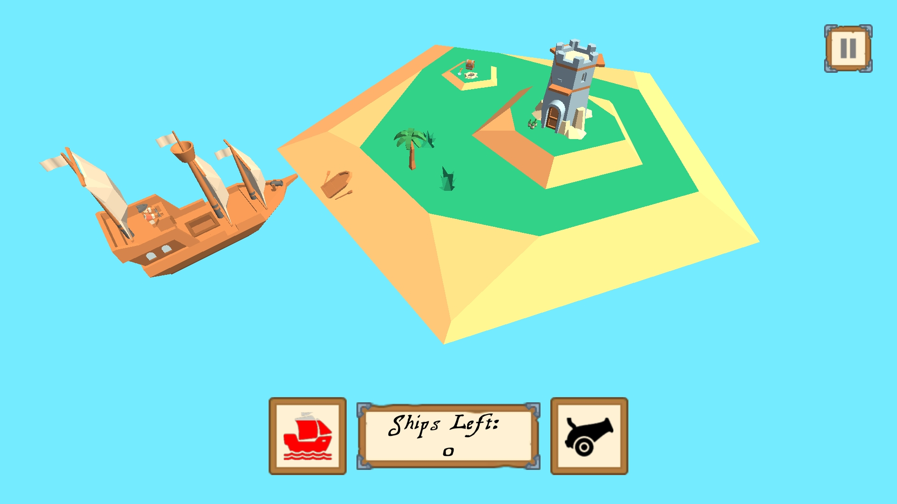

# A Pirate's Journey
 

A casual pirate action game where the objective is to get through the opposing pirates that are defending the island and grabbing the booty for yourself! Drag or tilt your way to victory and tap to sink your enemies!

 

## Gameplay
* Tilt the phone to move the ship around, or use the drag option to have the ship move to your finger.
* Tap in the direction you want to shoot to fire the cannons.
* Avoid the rocks (and crashing into other ships).
* Upgrade your ship to have more cannons, damange, health, armor and more!
* Level-based game progression or engage in endless battle against opposing pirates.
* Pirate-themed background music!

 

## Features
* Acutal 3D models and basic animations.
* Google Play Games Service integration.
* Game data saved using both local device storage and cloud storage through Google Drive (no data is collected or used on our end).
* Google Ad-Mob integration (no other ad networks implemented). Banner, interstitial and rewarded video ads are implemented throughout the game.
* Achievements and leaderboards integrated through Google Play Games Service!

 

## Technical Features
* Dynamically generated maps based on the current level. The seed used to generate the map is the level number.
* Upgrade ship stats based on pre-determined levels defined [in this class](./Assets/Scripts/Data/Scaling.cs).
* Head-on collisions will immediately sink your ship while any side collisions will knock the ships outwards, damaging it, and damaging the opposing enemy ship. 
* All cannons will points at exactly the center of the area where the player has tapped.
* All cannonballs will be pooled and reused. The amount of cannonballs to spawn is based on the ship's rate of fire and the number of cannons.

 

## Screenshots

 

## Notes:
* Was previously released to the Google Play Store, but is no longer available.

 

## License:
* © 2018-2022 Victor Dang All Rights Reserved
* You may download and modify this project for educational and non-commerical use.